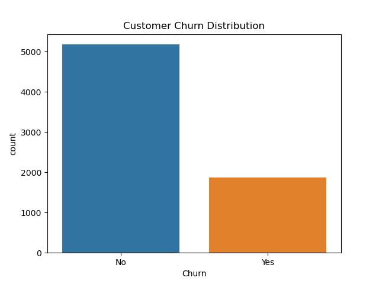
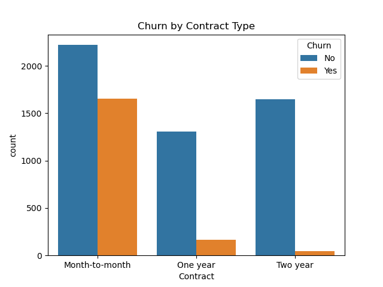
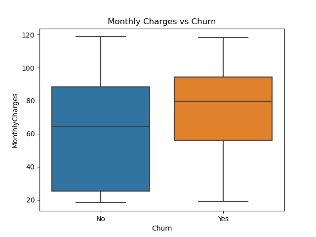
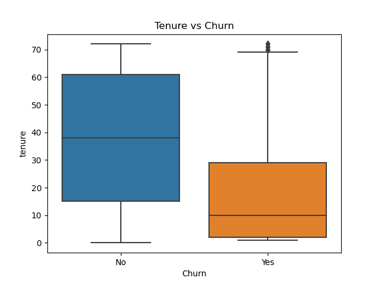
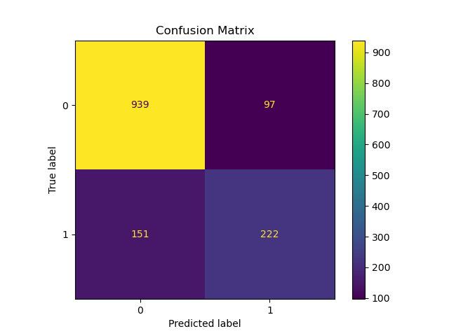

# Customer Churn Analysis (Machine Learning)

## Project Overview
This project analyzes customer churn using a telecom dataset and builds a machine learning model to predict whether customers will leave.

## Tools Used
- Python
- Pandas
- Seaborn
- Matplotlib
- Scikit-Learn

## Project Steps
1. Data Cleaning
2. Exploratory Data Analysis
3. Feature Engineering
4. Model Building (Logistic Regression)
5. Model Evaluation

## Model Performance
Accuracy: *82%*

## Key Insights

- Customers with *month-to-month contracts churn more*
- Customers with *short tenure are more likely to leave*
- Higher *monthly charges increase churn risk*

## Visualizations

